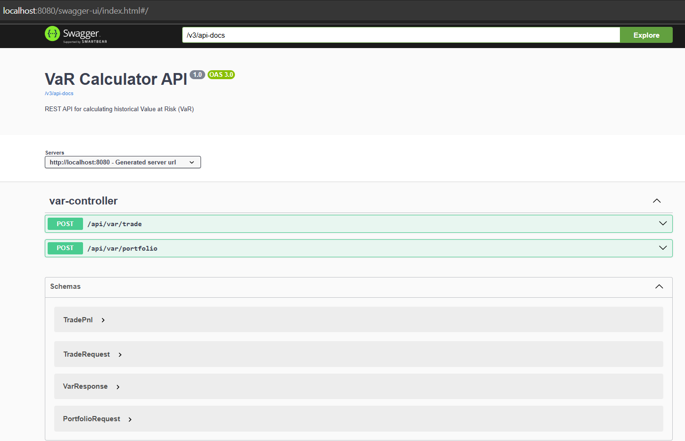

# VaR Calculator REST API

A Spring Boot application for calculating **Value at Risk (VaR)** using historical PnL data — supports both single trades and portfolios. Implements clean OOP design with full Swagger support, Docker support and validation.

---
## Assumptions

- This project focuses solely on computing **historical VaR**, which does not require high-performance infrastructure. The goal is to demonstrate quality of delivery, clean architecture, intuitiveness and usability.
- Clients should be able to run the solution out-of-the-box with no setup beyond executing the provided Maven Wrapper or pulling uploaded docker image.
- ⚠️ This solution is **not** designed for computing VaR at institutional scale (e.g., entire books at a bank or hedge fund). Those would require nightly batch pipelines or distributed compute frameworks. For example:
  > At one of my previous bank, historical VaR was computed for ~500,000 swap trades, each priced and sensitivity-bumped over multiple scenarios. This required ~3 hours on multicore infrastructure — ideally handled today via grid computing.

---
---

## VaR Calculation Formula

### What is Historical VaR?

Historical VaR estimates the potential loss in a portfolio by sorting actual historical PnL values and selecting the loss at a given percentile.

### Formula (Java Logic)
```java
Collections.sort(pnlList);
int index = (int) Math.floor((1 - confidenceLevel) * pnlList.size()); // or pnlList.size()-1 
VaR = Math.abs(pnlList.get(index));
```


##  Running App (Multiple options)
- Deployed as a free docker service (Might be down or long delay startup time)
https://var-api-avm.onrender.com/swagger-ui/index.html
## Download code and Run & Test (Without IntelliJ)
```bash
git clone https://github.com/zhossainny/var-api.git
cd var-api
./mvnw spring-boot:run  # now go to the url. note: in cmd promt: mvnw instead of ./mvnw
./mvnw test # only if you want to run test
./mvnw -Dtest=VarCalculationServiceTest test # only if you want to run particular test
```
The app starts at: `http://localhost:8080/swagger-ui/index.html


## How to Run (With IntelliJ)

### Requirements
- Java 17+  
- No Maven installation needed (uses Maven Wrapper)
- If java 17 does NOT exist then build and run using following command after changing to any version i.e: <java.version>11</java.version> in POM.xml
```bash
./mvnw clean package
java -jar target/var-api-1.0.0.jar

```
### Otherwise Launch the App by simply (unzip project and then ..)
```bash
cd var-api/       # Navigate into the project directory
chmod +x mvnw     # (Linux/macOS only)
./mvnw spring-boot:run
```

The app starts at: `http://localhost:8080/swagger-ui/index.html

---
---

## 🐳 Run Using Docker

You can run this app directly using Docker without installing Java or Maven.

### 🔹 Step 1: Pull from Docker Hub
```bash
docker pull zhossainny/var-api:latest # uploaded image for the demo
```

### 🔹 Step 2: Run the container
```bash
docker run -d -p 8080:8080 zhossainny/var-api:latest
```

This runs the container in the background and exposes the app on:
```
http://localhost:8080/swagger-ui/index.html
```

To stop the container:
```bash
docker ps                       # Get container ID
docker stop <container_id>
```

### 🔹 Step to Build your own local image if needed (Dockerfile provided)
```bash
docker build -t var-api .
docker run -d -p 8080:8080 --name var-api var-api
# go to the url provided or check curl
docker stop var-api

```

---
## API Docs (Swagger)

Visit in browser:
```
http://localhost:8080/swagger-ui/index.html
```

### Sample Input: Single Trade
```json
POST /api/var/trade

{
  "trade": {
    "pnls": [100, -50, 20, -10, 15, -90, 60, -40, 10, -5]
  },
  "confidenceLevel": 0.95
}
```

**Response**
```json
{
  "var": 90.0
}
```

---

### Sample Input: Portfolio
```json
POST /api/var/portfolio

{
  "trades": [
    { "pnls": [10, -20, 30, -40, 50] },
    { "pnls": [-5, 15, -25, 35, -45] }
  ],
  "confidenceLevel": 0.95
}
```

**Response**
```json
{
  "var": 5.0
}
```

---

## Error Examples

### Trade with empty PnLs:
```json
{
  "trade": {
    "pnls": []
  },
  "confidenceLevel": 0.95
}
```

**Response**
```json
{
  "pnls": "PnL list cannot be empty"
}
```

### Invalid confidence level:
```json
{
  "trade": {
    "pnls": [10, 20]
  },
  "confidenceLevel": 1.5
}
```

**Response**
```json
{
  "confidenceLevel": "Confidence level must be between 0 and 1"
}
```

---

## Running Tests
```bash
./mvnw test
```

Includes:
- Unit tests (`HistoricalVarCalculator`, `VarCalculationService`)
- REST integration tests (`VarControllerIntegrationTest`)

---

## Build Jar
```bash
./mvnw clean package
java -jar target/var-api-1.0.0.jar
```

---

## Project Structure (Typical spring boot Rest structure)

```
src/
├── controller/         # REST controllers
├── service/            # Core calculation logic
├── dto/                # TradeRequest, PortfolioRequest, etc.
├── util/               # HistoricalVaR calculation
├── config/             # Swagger config
└── exception/          # Global + field-level exception handling
```

---

## Class Diagram (UML)

```
VarCalculationService
 ├─ calculateTradeVar(TradeRequest)
 └─ calculatePortfolioVar(PortfolioRequest)
       └─ pnls is they main array of data 

TradeRequest → contains TradePnl + confidenceLevel
PortfolioRequest → List<TradePnl> + confidenceLevel
TradePnl → List<Double> pnls
```

### Class Diagram


### Program Flow


### SWAGGER UI PAGE http://localhost:8080/swagger-ui/index.html


## Contact
Zahid Hossain (zahidhossain8091@gmail.com)
